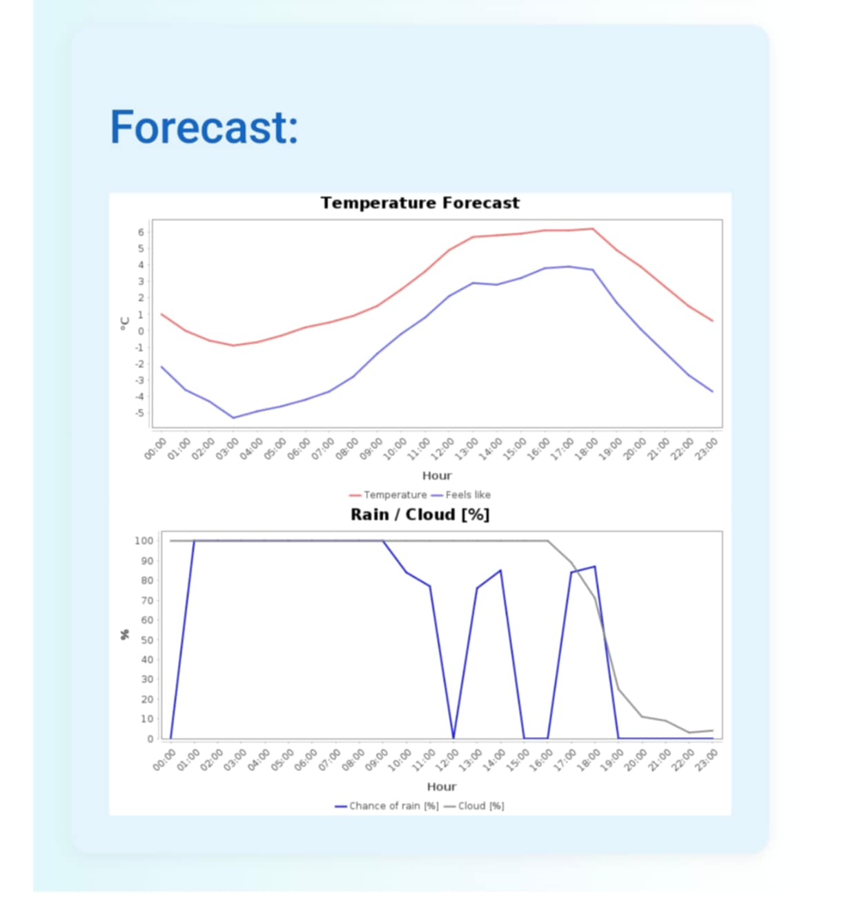

# SmartWeather on RaspberryPI

Weather&Forecast app for informing user about weather based on the location and provided schedule. Application based on the external weather api genering e-mail templates.

## Table of Contents

- [Requirements](#requirements)
- [Installation and configuration](#installation-and-configuration)
- [Raspberry Pi configuration](#raspberry-pi-configuration)
- [Usage](#usage)
- [Technologies](#technologies)
- [Testing](#testing)
- [Roadmap](#roadmap)

## Requirements
- Java 21
- Spring boot 3.4.4 +
- Maven 3.9.4 +
- Docker (for testing purpose)
- Docker Compose (together with docker to run on Raspberry Pi)
- MongoDB 4.4.18 (compatible version with Raspberry Pi architecture)

## Installation and configuration
1. Clone app repository to your local machine <br>
```shell
https://github.com/OskarCh29/SmartWeather.git
```
2. Ensure that you setup MongoDB and Docker to be ready for running
3. Navigate to the `application.yaml` file located in the `resources` folder

- Environment Variables

    To run this project, you will need to add the following environment variables to your .env file / IDE running configuration or by just writing in `application.yaml` file 
    <br>

    `MAIL_HOST` - Default set to smtp.gmail.com 

    `MAIL_PORT` - Default set to 587

    `MAIL_USERNAME` - Username to the `sender` e-mail (used for sending e-mails)

    `MAIL_PASSWORD` - Password for `sender` e-mail (used for sending e-mails)

    `API_KEY` - Api key obtained from weatherAPI.com

    `ADMIN_EMAIL` - Email to recieve weather information

    `SUBSCRIBE_EMAIL` - Additional email to recieve information

    Be aware that `ADMIN_EMAIL` and `SUBSCRIBE_EMAIL` must be setup for proper project working. In the future this will be transfered to another database.
    Also when in `application.yaml` write down <b> location<b> which you like to observe in your reports (provide names in English)
4. Configure MongoDB port if working on other than 27017 (mongodb-uri section)
5. When finish run the application with your IDE or with command window and following command:
```shell
mvn spring-boot:run
```
## Raspberry Pi configuration
Project was made on the Raspberry Pi 3 device and needs more like the same configuration as local machine. Configuration will be for device connected with SSH. If using device with all setup just navigate to the proper folders and provide configuration with command window<br>
1. Connect to your Raspberry Pi by SSH.
Check if Pi is avaliable and responding. Then connect by SSH
``` shell
ping raspberrypi.local
ssh pi@raspberrypi.local
```
Using SSH `pi` is your device username. It's also possible to connect with Raspberry Pi ip
```shell
ssh pi@{YourIP}
```
2. Set all enviromental variables with the following guide
```shell  
nano ~/.bashrc 
```
Provide enviromental variables at the end of file with `EXPORT`
These would be loaded for single user. If like to set env global use:
```shell
sudo nano /etc/enviromental
```
3. Before starting be sure you have docker-compose loaded for MongoDB
File docker-compose is located in the main app folder. It provides MongoDB database by image so it's no need to have database manually installed. If you installed on your raspberrypi docker and docker-compose run this command in the main app folder:
```shell
sudo docker-compose up -d
```
This will run the mongoDB container which provide you database connection.
To check if everything is ready and mongoDB is running provide command:
```shell
sudo docker-compose ps
```
4. Start the application
Start the application with the maven command:
```shell
mvn spring-boot:run
```

## Usage

If all is setted up properly app will run automaticlly and will be sending reports based on the provided schedule.
- How to set up / edit the schedule
    <br>
    Base schedule is set to generate reports everyday at 08:00 in the morning. If like to   change basic settings navigate to the main app folder and locate java class `DailyForecastScheduler.java`. 
    After finding annotation @Scheduled just edit the cron in the brackets. Provide proper  cron expression<br>
    
Example of the report:<br>


## Technologies

<b>Java:</b> The primary programming language for building backend logic

<b>Spring Boot:</b> A framework used to develop the RESTful application that handles intereacting with the weather data API etc

<b>Maven:</b> Used for dependency management and project build automation

<b>Docker:</b> Used for testing, making it easier to isolate the application and making integrating testing

<b>Docker Compose:</b> Utilized to set up and manage the MongoDB database on Raspberry Pi, allowing database integration

<b>MongoDB:</b> A NoSQL databased used to store weather report. Will be also used for statistics in the future

<b>Raspberry Pi:</b> The hardware platform on which the application runs

## Testing

To run tests, run the following command. Be aware that all integration tests would be run and docker should be running.

```bash
  mvn clean test
```
The project uses checkstyle validation, so if there are any checkstyle errors app will not run. All errors would be provided in the checkstyle-result file.<br>
Project also provided Jacoco test coverage reports. If you are interested run:
```bash
mvn jacoco:report
```
At the moment coverage is almost 100%

## Roadmap

- Add configuration webside (front-end)

- Add dataBase statistics for interested users

- Add user accounts with authorization and MySQL data storage
